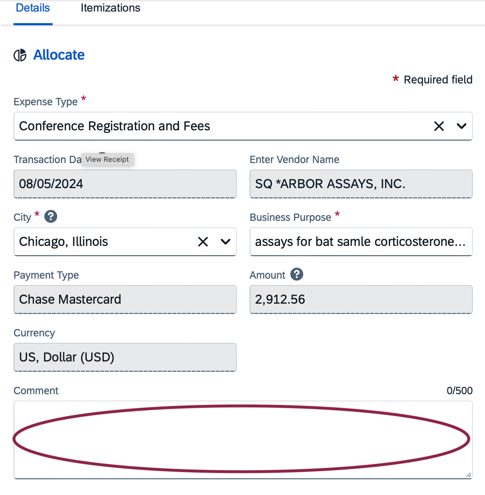

# Submitting reimbursements via Concur

1. Expenses get filed in two places– those placed on Cara’s personal card are listed [here](https://docs.google.com/spreadsheets/d/1_OaJ9DJeNGAnOdjrYlZIkjgvzWub6I010dUUwKFL0BU/edit?gid=0#gid=0) and those placed on the lab GEMS card are listed [here](https://docs.google.com/spreadsheets/d/1pEHxX_HBmt6vuNe0i8QS_IvNYWS5xNFENYThT5mcRtg/edit?gid=0#gid=0). 

2. Receipts for each type of transaction are listed on Box. Those for Cara’s personal card are uploaded [here](https://uchicago.app.box.com/s/6827t149q4hdl0z6fta47hvj2l4noysv). Those for the lab GEMS card are uploaded [here](https://uchicago.app.box.com/s/x4ed7d1zrwopwv0hmugzy1vjfbyem5a0).
- Note: For purchases made in the field on the GEMS card (Jumbo, etc.), itemized receipts must be submitted (applicable to non-field purchases as well).

3. The GEMS expenses should be already visible to you when you log into [Concur](https://www.concursolutions.com), while the personal card expenses will require you to make a new report and add all the details when you submit. 
- Note: Any receipts in Ariary will be automatically converted to USD currency by the Concur software. However, in the ‘Comment’ box at the bottom of every expense that is converted, it is necessary to look up the currency conversion for the date of purchase in [XE](https://www.xe.com/currencyconverter/) and write “XE currency conversion on XYZ [date]: 1 MGA = XXX USD”. Often, this will be a slightly different value than what is entered in Concur, and that is ok.

4. For step-by-step help directions on how to reconcile expenses in Concur, please follow the directions listed [here](https://github.com/brooklabteam/brooklab-resources/blob/main/oracle-step-by-step.md).

5. Please gray out all transactions after they have been submitted on the personal card and GEMS card spreadsheets.

6. In addition, please check that each item listed on either expense report gets entered into the appropriate spreadsheet tracking for the grant to which it was charged. It should be entered both in the itemized grant sheet [here](https://uchicago.app.box.com/s/ds2h2fuzne01pjwg04k5jc711zcbmibw) and the in the grants overview sheet [here](https://uchicago.app.box.com/s/gwy2w3sx6l7lm062ayc6fhqy7jm3ik6n).

7. At the end of each month, please sum the monthly total for each grant on the itemized sheet, and check that it matches the total in the overview sheet. Then, convert the next month from blue to black on the overview sheet, and update the projected and spent funding totals accordingly (e.g. make sure the project sums over just the blue and the spent sums over the black).

8. Finally, at the end of every month, please add a new section to the monthly expense report document [here](https://docs.google.com/spreadsheets/d/1GU_2yYmVBj-gkAE3OcGE0G9xld4YRzve7rfLKszff-E/edit?gid=0#gid=0), and slack Cara to let her know everything has been updated.
