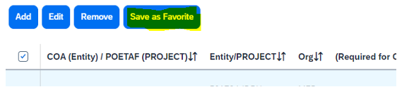

# Reconciling expenses in the Oracle system

**This example is for charging expenses to PPM Projects (e.g. sponsored awards, IADF) using POETAF** 

1.	Log in to GEMS and create a new report (or click on an expense that has already posted from a GEMS card).

2.	Creating a new report will you show an initial summary page where you will choose whether to charge these expenses to COA (ie, general operating account) or to a Project (ie, an NIH grant, faculty member’s IADF start-up funds). **You will basically always select to apply expenses to a Project (POETAF).**

*NOTE: You can split expenses between multiple projects later in the process (ie, split 50/50 between two different sponsored awards, etc) – but for this initial summary page, you can only select one Project. See the steps related to the ‘Allocation’ process later in this document to split expenses*

Select the following options and enter the relevant POETAF values for the Project you are charging this to (the example here is using the POETAF info for FAS account 520486, which corresponds to USP1000449 in the new system):

For reference, here is the mapped COA/POETAF info for the Project (520486/USP1000449) used in this example:

3.	Once the information is entered for each field, scroll to confirm whether a Travel Allowance is needed – enter the appropriate response and then save and continue: 

4.	Add an expense with the appropriate details (date, amount, location, receipts, etc) and then click the ‘Allocate’ option once the expense info has been filled in: 

Although the Project information was completed when we started this report, the system will draw in a default COA accounting string that may be incorrect when using a Project/POETAF, so that is what we are going to correct when we select ‘Allocate’:

In this example, the two highlighted values (Fund 100000 and Purpose 430) are default COA values that automatically populated and need to be corrected.

 

To correct these fields, click “Add” and then a box will pull up the current allocations:

Make the appropriate COA corrections and then click ‘Save’:

Select the new allocation checkbox and Save again:

5.	Now it will take you back to the expenses screen – from there, to confirm the allocation is correct, go to ‘Allocation Summary’:

Here we see that the full Project and COA string is now correct since it lists ‘310001/Federal G&C – Direct Recipient’ instead of ‘100000/General Operating’, and lists ‘200/Research – Sponsored Organized’ instead of ‘430/Other Academic Activities.’ 

Once the corrected allocation string has been entered, you can also save it as a Favorite so that it shows up again: 

*TIP: If you have lots of expenses it may be easier to add each expense but wait until the end once all have been added to allocate them all at once.  In that case, add each expense and then select the check box next to each one once ready and click ‘Allocate’ and then add the corrected allocation info as shown in Step 4 and save accordingly.*

6.	If you need to split an expense on the same report between multiple Projects, then select the relevant expense using the checkbox next to its line on the ‘Manage Expenses’ screen select ‘Allocate’ Enter any additional Projects you wish to allocate this to using the ‘Add’ button and save their info. Apply the percentage or amount to each Project:

Save the desired split between projects for the expense. 

Additional Notes:

*The search function in each of the fields/dropdown boxes may only work if you select ‘Either’ (it automatically searches based on ‘Text’ and the other option is ‘Code’ – if you are searching a Project number or any other value that contains both numbers and letters, then you must have ‘Either’ selected in order for results to show):*

